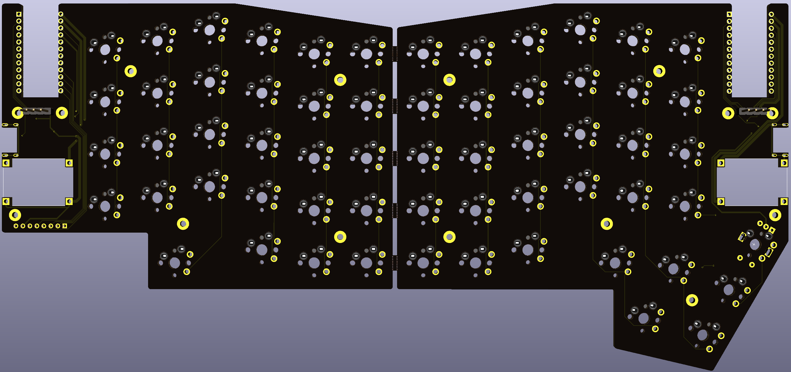

# Galia
Split 63-key ergo keyboard with trackball on right-hand side.

## Disclaimer
The layout is based on the [Ergodash](https://github.com/omkbd/ErgoDash) layout with the inner-most keys removed and a modified thumb cluster on the left hand side, and integrated 34mm trackball on the right. The Pro Micro position was also moved inwards to allow for a thinner board. The Ergodash layout was only used as a reference, nothing was copied and the board is a completely new design. Finally, the mechanical design of the [aball](https://github.com/brickbots/aball) was referenced for the design of the trackball mount.

## Key Features
* Slim design, or as slim as I could get while using standard MX-style Switches. Essentially, the Pro Micro or whatever other microcontroller used mounts under the PCB, flush and facing up with the help of a cutout.
* SMK MX-style switch support, solder only but the holes are mill-max socket compatible.
* OLED support, either using a standard 0.91" SSD1306 OLED or the [Crenshaw](https://github.com/Ariamelon/Crenshaw) 1.3" OLED breakout board made by me.
* 34mm trackball support using the [Ogen](https://github.com/Ariamelon/Ogen) PMW3360 sensor board. Also compatible with [Jack's](https://www.tindie.com/products/jkicklighter/pmw3360-motion-sensor/) version. 
* Useable in both wired and wireless modes.
* Supports either on-board charger or an external TP4056-based charger for faster charging. TP4056 charger is also flush-mounted and supports the use of 0305 or 7305 mill-max hotswap sockets if desired.
* Case design with plate included with in-built 10° tent. Plate assumes use of the Crenshaw.
* The case supports up to a 6000mAH battery (two 804070 cells in parallel).

